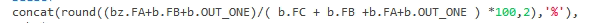
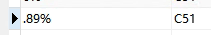

# Oracle

### 小数转字符串时，小数点前的0消失

`to_char('0.12')`会在结果集中显示为.12，因为Oracle默认的格式是不显示0的

`to_char('0.12','fm99990.099') `则会展示为 0.12

其中 **9** 代表 如果存在数字则显示数字，不存在显示空格

其中 **0** 代表 如果存在数字则显示数字，不存在则显示0， 即占位符

其中 **FM** 代表 如果是因为9 带来的空格则删除

所以上述表达式翻译出来就是:`整数位5位，个位必定展示，其他整数位有则展示无则不显示；小数位3位，第1位必定展示，其余有则展示`

对于`concat()`也存在了这个问题，可以用to_char格式化一下

